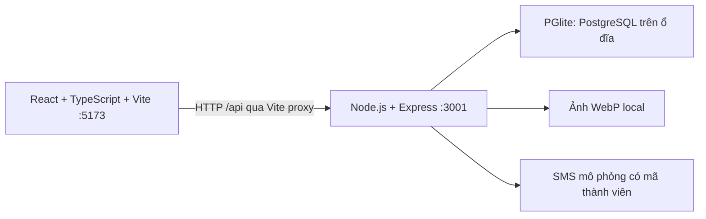

# Kiến trúc backend local đang chạy

## Thành phần

PGlite là PostgreSQL chạy bằng WebAssembly, hỗ trợ lưu database vào filesystem trong Node.js. Không phải một mảng dữ liệu giả hoặc SQLite. Bản này chạy một tiến trình backend; không dùng cho nhiều server cùng truy cập thư mục database. [Tài liệu PGlite](https://pglite.dev/docs/about), [lưu trên filesystem](https://pglite.dev/docs/filesystems).

- `server/index.mjs`: khởi động API, bind 127.0.0.1, đóng database khi dừng.
- `server/backend.mjs`: tạo ứng dụng, kiểm tra quyền, Auth, OTP, hồ sơ, lớp, ảnh.
- `server/migrations/001_initial.sql`: schema PostgreSQL có FK/index/constraints.
- `server/seed.mjs`: hồ sơ giả, tài khoản mẫu và phân công quản lý lớp.
- `src/lib/api.ts`: HTTP client, hợp đồng session/challenge/bootstrap và xử lý lỗi.
- `src/lib/utils.ts`: trình bày ngày, tên viết tắt và tìm tên gần giống/bỏ dấu.
- `tests/backend.test.mjs`: chạy HTTP API với database riêng, đóng/mở lại để kiểm tra persistence.

## Database

| Bảng | Mục đích |
|---|---|
| members | Hồ sơ, mã PH… khóa chính, nhóm, SĐT, địa chỉ, ngày sinh, ngày đăng ký, người giới thiệu FK |
| accounts | Liên kết một hồ sơ, password hash, role, trạng thái đã xác thực Auth |
| classes / class_managers | Lớp, nhóm của lớp và phân công quản lý |
| enrollments | FK hồ sơ/lớp, khóa chính ghép chống đăng ký trùng |
| registration_fields | Toggle trường bắt buộc |
| sessions | Hash token phiên và hạn dùng |
| challenges | Account/purpose/phone/session, OTP hash, hạn dùng, số lần thử, trạng thái tiêu thụ |
| password_grants | Quyền đổi mật khẩu một lần, gắn account và session |
| audit_log | Nhật ký đổi mật khẩu và sửa hồ sơ, không ghi mật khẩu/OTP |
| app_meta | Khóa HMAC cho OTP local |

SĐT có index thường, **không UNIQUE**. Mã được cấp bằng PostgreSQL sequence; nhiều hồ sơ dùng chung số vẫn là các tài khoản độc lập. `verified` xác minh OTP đăng ký, không phải phê duyệt thành viên bởi quản lý. Vai trò tách khỏi nhóm sinh hoạt.

Bản local dùng mã thành viên làm khóa chính để giữ hợp đồng frontend. Khi chuyển production có thể thêm UUID nội bộ và giữ mã PH… làm public identifier. Date là cột PostgreSQL `date`, API trả ISO YYYY-MM-DD; thông tin hồ sơ không bị gom vào JSON blob.

## Auth và quyền

Mật khẩu được băm bằng scrypt với salt ngẫu nhiên. Phiên dùng token 256-bit ngẫu nhiên, chỉ lưu hash trong DB; cookie HttpOnly, SameSite=Strict, thời hạn 8 giờ, path `/api`. Cookie local qua HTTP không đặt Secure; production phải dùng HTTPS/Secure. Frontend không lưu mật khẩu hay token phiên trong localStorage.

Đăng nhập dùng mã hoặc SĐT. Nếu số trùng, API yêu cầu mã thành viên, không trả tên/danh sách các tài khoản cùng số. Chỉ sau khi mật khẩu đúng mới phát challenge. OTP HMAC gắn challenge, challenge gắn account/purpose và pre-auth token bí mật. Đổi mật khẩu còn gắn session hiện tại. OTP hết hạn sau 5 phút, tối đa 5 lần sai, dùng một lần; gửi lại sau 30 giây và hủy mã cũ. Verify/consume/grant dùng transaction để chống replay. API Auth giới hạn 30 yêu cầu/phút/IP trong bản local.

Đổi mật khẩu yêu cầu OTP mới → grant 256-bit một lần, hạn 5 phút → băm mật khẩu mới → consume grant và thu hồi phiên khác. Password-change grant không thể lấy từ OTP đăng nhập hay OTP của tài khoản khác.

`GET /api/bootstrap` trả dữ liệu theo quyền:

- Chưa đăng nhập: chỉ cấu hình đăng ký, không có hồ sơ hoặc đăng ký lớp.
- Huynh đệ: danh bạ tên/mã/nhóm/khu vực/ảnh, hồ sơ đầy đủ của mình và lớp mình đăng ký.
- Quản lý lớp: thêm hồ sơ đầy đủ và đăng ký của lớp được phân công.
- Quản lý tổng: toàn bộ hồ sơ và đăng ký lớp.

Mọi API ghi kiểm tra quyền server, không tin role/ID do frontend gửi. Huynh đệ chỉ sửa mình, quản lý tổng sửa mọi hồ sơ; quản lý lớp không sửa hồ sơ người khác. Hủy đăng ký cho người khác phải có quyền đúng lớp. Ảnh chỉ đọc khi đã đăng nhập.

## API hiện tại

| Method | URL | Chức năng |
|---|---|---|
| GET | /api/health | Trạng thái local |
| GET | /api/bootstrap | Session + dữ liệu đúng phạm vi quyền |
| POST | /api/auth/register | Tạo tài khoản chưa kích hoạt và challenge đăng ký |
| POST | /api/auth/login | Kiểm tra mật khẩu và tạo challenge |
| POST | /api/auth/verify | Tiêu thụ OTP, cấp session hoặc password grant |
| POST | /api/auth/resend | Thay challenge sau cooldown |
| POST | /api/auth/password-challenge | OTP đổi mật khẩu của phiên hiện tại |
| POST | /api/auth/password | Cập nhật mật khẩu bằng grant |
| POST | /api/auth/logout | Thu hồi session |
| PATCH | /api/members/:id | Cập nhật hồ sơ, xử lý ảnh WebP |
| PATCH | /api/requirements/:field | Quản lý tổng đổi toggle |
| PUT / DELETE | /api/enrollments/:classId/:memberId | Đăng ký/hủy lớp |
| GET | /api/avatars/:key | Đọc ảnh sau xác thực |

## Giới hạn của bản local và bước chuyển lên Supabase

Bản này triển khai Auth tại API riêng để thử nghiệp vụ, **không phải Supabase Auth**. SMS provider trả code và preview cho frontend có chủ ý để kiểm thử; production tuyệt đối không trả OTP. Ảnh được Sharp decode/re-encode WebP phía server, giới hạn kích thước, lưu filesystem thay R2. Bộ lọc/tra cứu/phân trang đang xử lý trên tập hồ sơ đã được API giới hạn quyền, phù hợp dữ liệu local nhỏ.

Toggle phone/password vẫn tồn tại theo yêu cầu. SĐT và mật khẩu là điều kiện bắt buộc để kích hoạt tài khoản đăng nhập dù toggle hồ sơ tắt. Nhắc hồ sơ cũ thiếu trường, email, quên mật khẩu, cấp quyền qua UI và thêm lớp chưa triển khai. Sửa SĐT trong bản local yêu cầu phiên có 2FA; thay số làm hủy OTP/grant cũ nhưng chưa có bước xác minh số mới. Cần thêm luồng xác minh kênh mới trước khi production. Ảnh cũ/orphan cần tác vụ dọn dẹp khi lên R2.

Khi chuyển production: dùng Supabase PostgreSQL + migrations và RLS/column projection; ánh xạ mỗi tài khoản sang Supabase Auth identifier riêng để hỗ trợ chung SĐT; SMS Hook thêm mã thành viên; private R2 adapter; HTTPS; rate limit bền vững theo IP/account/phone; kiểm tra recovery và password update không thể bypass OTP. Không apply schema local vào project public rồi mở Data API: bảng `accounts`, session, OTP phải nằm trong schema private/quyền hạn chế. Xem [kế hoạch production chi tiết](PRODUCTION-PLAN.md).
