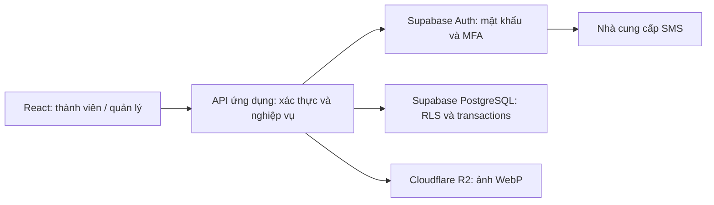

# Đạo Tràng Phật Hào — kế hoạch production (tài liệu giai đoạn frontend)

Tài liệu này lưu thiết kế production từ giai đoạn frontend. Backend local hiện đã được triển khai; mô tả “bản mẫu” bên dưới là bối cảnh cũ, không phải trạng thái đang chạy. Xem ARCHITECTURE.md cho API, Auth và database local hiện tại. Chưa kết nối Supabase hay R2 thật.

## 1. Phân lớp

Giữ frontend này, thêm API riêng (Node.js hoặc Edge Functions). Không cần viết lại giao diện sang framework khác chỉ để có backend. Browser không chứa service-role key, khóa R2 hay bí mật của nhà cung cấp SMS. API tiếp nhận danh tính người dùng và áp dụng các chính sách theo người dùng; không dùng service role cho mọi thao tác rồi bỏ qua RLS.

Cấu trúc hiện tại:

- `src/App.tsx`: điều hướng và các màn tổng quan, thành viên, lớp, tra cứu, hồ sơ, cấu hình.
- `src/components/MemberForm.tsx`: biểu mẫu hồ sơ/đăng ký, kiểm tra đầu vào và ảnh WebP mẫu.
- `src/components/Auth.tsx`: đăng nhập/đăng ký/OTP mô phỏng.
- `src/lib/types.ts`: hợp đồng dữ liệu TypeScript.
- `src/lib/demo.ts`: dữ liệu mẫu, tra cứu không dấu, lưu trạng thái demo.
- `docs/`: kiến trúc và checklist duyệt.

Khi làm backend, tách màn trong App thành `src/features/{members,classes,auth,profile,settings}`, chuyển truy cập dữ liệu sang repository/service có cùng hợp đồng; thay localStorage bằng HTTP API. Không coi cơ chế kiểm tra role trên giao diện là biện pháp bảo mật.

## 2. PostgreSQL: quan hệ rõ ràng, dễ mở rộng

| Bảng dự kiến | Cột/chức năng chính |
|---|---|
| `members` | `id uuid PK`, `auth_user_id uuid UNIQUE NULL FK auth.users`, `member_code text UNIQUE`, `auth_login_identifier text UNIQUE` (private), `full_name`, `birth_date date`, `phone_e164`, `address`, `region_id FK`, `group_id FK member_groups`, `referred_by FK members`, `avatar_object_key`, `registered_on date`, `created_at timestamptz`, `updated_at`, `deleted_at` |
| `member_groups` | `id`, `code UNIQUE`, `name`; ba nhóm: Chúng thiếu nhi, Chúng thanh niên, Đạo tràng |
| `regions` | `id`, `name`, `parent_id FK regions`, `code`; tổ chức tỉnh/khu vực theo cây, tránh hardcode địa giới trong frontend |
| `roles` / `member_roles` | Vai trò cấp hệ thống; `super_admin` áp dụng toàn cổng, không lưu quyền trong metadata mà người dùng tự sửa được |
| `classes` | `id uuid PK`, `title`, `description`, `group_id FK member_groups`, `registration_status`, `capacity NULL`, `location`, `schedule`, `created_at` |
| `class_managers` | `class_id`, `member_id`; khóa chính ghép, quản lý có thể phụ trách nhiều lớp |
| `class_enrollments` | `class_id`, `member_id`, `status`, `registered_at`, `cancelled_at`; UNIQUE `(class_id, member_id)` để chống đăng ký trùng |
| `registration_fields` | `field_key UNIQUE`, `required boolean`, `enabled`, `sort_order`, `config_version`, `updated_by`, `updated_at` |
| `audit_events` | `id`, `actor_id`, `action`, `entity_type`, `entity_id`, `changed_fields`, `created_at`; hạn chế lưu PII trong log |
| `password_change_grants` | Grant một lần gắn user, purpose, challenge, hạn dùng và used_at; lưu server nếu cần ràng buộc OTP mới cho mỗi lần đổi mật khẩu |

`auth_user_id` liên kết hồ sơ đăng ký sinh hoạt với tài khoản Auth sau khi xác minh SĐT. Frontend không có chức năng quản lý thêm hay xác nhận thành viên. `registered_on` là ngày người dùng điền; `created_at` là thời điểm hệ thống tạo, không thể giả sửa. Mã PH00001 chỉ là định danh hiển thị; UUID là khóa chính nội bộ. Mã được cấp bằng sequence/transaction, không dùng `max + 1` như demo.

Thông tin lõi dùng cột typed và foreign key. Nếu cần trường mới, dùng bảng field definitions/values hoặc một `extra jsonb` giới hạn cho trường phụ; tránh chuyển toàn bộ hồ sơ thành JSON khó truy vấn. Tên người giới thiệu được truy xuất bằng join; không nhân bản tên trong hồ sơ.

Index dự kiến: unique member_code, index thường trên phone_e164 (không UNIQUE), `(region_id, registered_on DESC, id)`, `(registered_on DESC, id)`, `(class_id, status)` ở enrollments. Chuẩn hóa chuỗi tìm kiếm bỏ dấu (gồm đ → d) và dùng `pg_trgm`/GIN để xếp hạng similarity; mã trùng chính xác đứng đầu, kế đến prefix, tên tương tự. Chuỗi chuẩn hóa được cập nhật nhất quán bằng trigger/service; không giả định `unaccent` có thể dùng trực tiếp trong mọi expression index. Danh sách dùng phân trang server và keyset khi dữ liệu lớn, không tải toàn bộ bảng vào browser. CSV xuất theo quyền và bộ lọc.

Cấu hình required được kiểm tra lại ở server khi tạo thành viên, trong cùng version cấu hình. Nếu tắt SĐT hoặc mật khẩu, có thể tạo hồ sơ ở trạng thái chưa kích hoạt, nhưng cần bổ sung thông tin Auth trước khi đăng nhập thật. Nhắc hồ sơ cũ thiếu trường bắt buộc chưa nằm trong giai đoạn này.

### Nhóm sinh hoạt và lớp học

Mỗi thành viên thuộc một trong ba nhóm: **Chúng thiếu nhi**, **Chúng thanh niên**, **Đạo tràng**. Nhóm sinh hoạt khác với vai trò quản lý và khu vực. Lớp **Tâm Lý Đạo Đức thuộc Chúng thiếu nhi**; liên kết bằng `classes.group_id`, không suy ra từ tên lớp. Hồ sơ và danh sách có nhóm, bộ lọc và CSV hỗ trợ nhóm. Cấu hình đăng ký có thêm trường nhóm sinh hoạt. Không tự phân nhóm theo tuổi vì chưa có quy định về độ tuổi. Các nhóm gán cho dữ liệu mẫu chỉ phục vụ duyệt giao diện.

Việc lớp thuộc một nhóm chưa tự quy định giới hạn đăng ký: bản mẫu giữ luồng đăng ký hiện tại. Nếu chỉ cho thành viên Chúng thiếu nhi đăng ký, cần chốt chính sách và enforce bằng server/RLS ở bước backend. Vai trò quản lý tổng vẫn truy cập mọi nhóm; quản lý lớp tiếp tục được phân công theo lớp.

## 3. Ma trận quyền

| Thao tác | Thành viên | Quản lý lớp | Quản lý tổng |
|---|---|---|---|
| Sửa hồ sơ của mình | Có | Có | Có |
| Tra cứu tên, mã, khu vực | Có | Có | Có |
| Xem SĐT/địa chỉ người khác | Không | Chỉ học viên lớp phụ trách | Có |
| Xem/sửa toàn bộ thành viên | Không | Không | Có |
| Đăng ký/hủy lớp của mình | Có | Có | Có |
| Quản lý danh sách học viên | Không | Chỉ lớp được phân công | Mọi lớp |
| Cấu hình đăng ký / phân quyền | Không | Không | Có |

RLS theo `auth.uid()`, hệ thống role và `class_managers`. Việc đọc cột nhạy cảm cần view/RPC/API projection phù hợp: RLS chỉ lọc hàng, không tự bảo vệ từng cột. Directory chỉ trả tên/mã/khu vực. Ngăn người dùng sửa role, auth_user_id, member_code và quyền lớp bằng column privileges hoặc RPC được kiểm soát. RPC đặc quyền phải có search_path cố định, kiểm tra caller và quyền execute hạn chế. Áp dụng AAL2 cho dữ liệu riêng và nghiệp vụ có yêu cầu MFA; AAL1 chỉ được đi vào thiết lập/xác minh MFA và các tác vụ onboarding tối thiểu.

## 4. Mật khẩu, đăng nhập và OTP — giải thích

**Mật khẩu** là điều người dùng biết. **OTP qua SMS** là mã ngắn hạn để chứng minh người dùng kiểm soát SĐT. Hai bước kết hợp tạo 2FA. Chỉ đăng nhập bằng OTP mà không có mật khẩu không tự động trở thành hai yếu tố.

Dùng Supabase Auth để quản lý mật khẩu và session. Không tự mã hóa, không lưu plaintext, không tạo cột password trong `members`; mật khẩu không được gửi vào log. SĐT nhận mã được chuẩn hóa E.164 (090… → +8490…). SĐT là kênh liên hệ có thể dùng chung, không phải định danh Auth duy nhất. [Supabase: Password-based Auth](https://supabase.com/docs/guides/auth/passwords).

Luồng SĐT: nhập SĐT + mã thành viên nếu SĐT dùng chung + mật khẩu → API xác định duy nhất member_id và auth_user_id → xác thực danh tính riêng với Supabase (AAL1) → challenge phone factor của user đó → SMS có mã thành viên + OTP → verify đúng factor/challenge/user → session AAL2 của đúng tài khoản. Không thử mật khẩu lần lượt trên các tài khoản chung SĐT hoặc tự chọn tài khoản đầu tiên. Lần đầu cần enroll và verify phone factor. Các bước enrollment và verification của Supabase được mô tả trong [Phone MFA](https://supabase.com/docs/guides/auth/auth-mfa/phone). Xác minh SĐT lúc đăng ký và enroll MFA là các bước khác nhau; không mặc định một bước tự thay thế bước còn lại.

Luồng mã thành viên: API nhận mã+mật khẩu → ánh xạ sang auth_login_identifier nội bộ (duy nhất) → xác thực với Supabase → tạo challenge cho phone factor của đúng auth_user_id → trả kết quả/session phù hợp, không trả SĐT hoặc danh sách tài khoản gia đình ra API lookup công khai. Bảo vệ endpoint bằng thông báo lỗi chung, rate limit theo IP/tài khoản và CAPTCHA sau ngưỡng. Không cho browser query cả bảng SĐT để chuyển mã sang danh tính Auth.

**Đổi mật khẩu:** yêu cầu challenge SMS mới → verify → quyền đổi mật khẩu một lần, gắn user/purpose và hết hạn ngắn → server cập nhật Auth → consume grant → vô hiệu hóa session khác theo chính sách. Chỉ có session AAL2 cũ chưa đủ để đáp ứng yêu cầu “mỗi lần đổi mật khẩu phải có OTP mới”. Cần thiết kế và thử nghiệm cả đường gọi trực tiếp API Auth; một endpoint riêng không đủ nếu API cập nhật của Auth vẫn cho phép bỏ qua điều kiện. Chốt cơ chế secure password change/reauthentication của Supabase hoặc Auth gateway chặn đường bypass trước production. Quên mật khẩu là recovery riêng, không cho mã demo hoặc yếu tố đã mất phục hồi tài khoản tùy tiện.

Supabase phone MFA dùng cấu hình nhà cung cấp SMS/Send SMS Hook; cần chọn nhà cung cấp hỗ trợ gửi về Việt Nam, kiểm tra gói Supabase và chi phí SMS lúc triển khai. Dùng hạn dùng OTP, giới hạn gửi lại/số lần thử, cooldown, cơ chế xử lý mất SĐT và nhật ký bảo mật. SMS chịu rủi ro SIM swap; tài khoản quản lý có thể bổ sung TOTP ở giai đoạn sau. Chưa triển khai email. Email OTP tương lai cần xác minh địa chỉ và thiết kế riêng, không mặc định là một loại MFA native tương đương phone factor.

[Supabase: RLS](https://supabase.com/docs/guides/database/postgres/row-level-security) là lớp kiểm soát database. Dùng auth.uid và assurance level từ session thật, tuyệt đối không lấy role do client gửi làm quyền.

## 5. Ảnh đại diện — Cloudflare R2

Bản mẫu: chọn JPG/PNG/WebP ≤5 MB → canvas thu nhỏ cạnh dài ≤480px → WebP → lưu data URL trên trình duyệt. Đây là cách thử giao diện; không upload R2 và không phù hợp lưu nhiều dữ liệu thật.

Production: API kiểm tra session/quyền → nhận ảnh vào vùng staging bằng URL ký ngắn hạn → worker xác minh định dạng qua nội dung, giới hạn dung lượng/kích thước, decode và re-encode WebP, loại EXIF → lưu object mới → cập nhật `avatar_object_key` trong PostgreSQL → xóa object cũ sau khi thành công. Có thể resize client để giảm băng thông nhưng server vẫn phải kiểm tra. Giữ bucket private; URL GET ngắn hạn hoặc avatar proxy có kiểm tra quyền. Không lưu presigned URL hết hạn vào database; chỉ lưu object key. [Cloudflare: presigned URLs](https://developers.cloudflare.com/r2/api/s3/presigned-urls/).

## 6. API dự kiến

- `POST /auth/register`, `/auth/login`, `/auth/mfa/challenge`, `/auth/mfa/verify`.
- `POST /auth/password-change/challenge`, `/auth/password-change/confirm`.
- `GET /directory?q=…`: projection an toàn, xếp hạng gần giống.
- `GET /members?q=…&region=…&from=…&to=…&sort=…&cursor=…`: chỉ quản lý tổng.
- `GET/PATCH /me`; `GET/PATCH /members/:id`: field allowlist và kiểm tra quyền.
- `GET /classes`, `POST/DELETE /classes/:id/enrollment`, `GET /classes/:id/enrollments`.
- `GET/PATCH /registration-fields`: quyền ghi của quản lý tổng.
- `POST /me/avatar/upload-intent`, `/me/avatar/finalize`.

Lỗi có cấu trúc {code, message, fieldErrors}. Dùng transaction cho cấp mã, enrollment và role changes, unique constraints chống race; audit cho mọi thay đổi quản trị. Giới hạn dữ liệu trả về theo vai trò và chỉ log định danh nghiệp vụ cần thiết.

## 7. Thứ tự triển khai sau khi duyệt frontend

1. Chốt bố cục, required fields và quy trình tạo hồ sơ/tài khoản.
2. Migrations PostgreSQL + RLS + kiểm thử quyền thật, phân công quản lý lớp.
3. Supabase Auth, provider SMS, đăng nhập qua mã, MFA, đổi mật khẩu và recovery.
4. Dịch vụ ảnh R2 và xử lý WebP server.
5. Thay demo repositories bằng API, thêm loading/error/retry và pagination server.
6. Kiểm tra gọi API trực tiếp, phân quyền chéo lớp, upload giả định dạng, OTP replay, đồng thời đăng ký lớp; backup và khôi phục.

## Điều chỉnh giao diện và quy trình

Bỏ các ô thống kê tổng thành viên, đang sinh hoạt, lớp đang mở, lượt đăng ký lớp và số tổng hợp ở các thẻ nhóm/lớp trên tổng quan. Bỏ trạng thái sinh hoạt/chờ xác nhận, lọc trạng thái và hành động xác nhận hồ sơ. Tài khoản quản lý chỉ xem và chỉnh sửa hồ sơ đã đăng ký; không có nút hay luồng thêm thành viên. Đăng ký sinh hoạt vẫn tạo hồ sơ mới và đi qua OTP mẫu. Ngôn ngữ giao diện thống nhất dùng huynh đệ, đăng ký sinh hoạt và tu học. Xác thực OTP là nghiệp vụ Auth, tách biệt với xác nhận thành viên đã bỏ.

## SĐT dùng chung cho phụ huynh và con

Mỗi hồ sơ/tài khoản có `member_code` và `auth_user_id` riêng. Nhiều tài khoản có thể có cùng `phone_e164`, bao gồm phụ huynh đăng ký cho con. Bỏ UNIQUE SĐT trong bảng nghiệp vụ; tạo index thường để tra cứu. Sửa SĐT của một hồ sơ không tự thay đổi hồ sơ khác; khi triển khai thật, xác minh lại kênh nhận OTP cho đúng tài khoản trước khi cập nhật phone factor.

Không dùng SĐT dùng chung làm danh tính primary của nhiều `auth.users`. Phương án dự kiến: mỗi user có một login identifier riêng do server sinh, ánh xạ bằng `member_code`, ví dụ địa chỉ nội bộ có UUID ở miền do đơn vị kiểm soát. Dùng Supabase email/password làm giao thức nội bộ; người dùng không cần nhập email, không bật đăng nhập/khôi phục qua email cho giao diện này. Không gửi mail tới địa chỉ giả của bên thứ ba; tạo/quản lý danh tính này qua server và kiểm chứng các đường recovery/password update trước production. Đây là identifier kỹ thuật, không phải tính năng email cá nhân. Mỗi tài khoản có mật khẩu riêng trong Auth.

Phone MFA là yếu tố thứ hai gắn với **user**, không phải tài khoản dùng chung. Mã nguồn chính thức Supabase có index `(user_id, phone)` và migration đã bỏ uniqueness SĐT ở cấp toàn bảng MFA factors: [schema phone MFA](https://github.com/supabase/auth/blob/master/migrations/20240729123726_add_mfa_phone_config.up.sql), [drop global phone uniqueness](https://github.com/supabase/auth/blob/master/migrations/20240806073726_drop_uniqueness_constraint_on_phone.up.sql). Khi tích hợp phải xác minh phiên bản/gói của project thực tế có các migration và phone MFA tương ứng.

Tạo challenge sau khi xác định account và qua mật khẩu. SMS ví dụ:

> Đạo Tràng Phật Hào: Mã thành viên PH00002. OTP 482719 để đăng nhập. Mã chỉ dùng cho tài khoản này, có hiệu lực 5 phút. Không chia sẻ mã.

Dùng [Send SMS Hook](https://supabase.com/docs/guides/auth/auth-hooks/send-sms-hook) để bổ sung member_code vào nội dung. Hook xác minh chữ ký và tra `user.id` → member_code bằng dữ liệu đáng tin cậy, gửi đến phone factor đúng tài khoản; không dùng mã thành viên hoặc số nhận do client tùy ý truyền để định tuyến SMS. Phone MFA hỗ trợ hook theo [tài liệu Supabase](https://supabase.com/docs/guides/auth/auth-mfa/phone).

Server phải ràng buộc `challenge_id`, `auth_user_id/member_id`, `factor_id`, số nhận, mục đích (`registration`, `login`, `password_change`), phiên/pre-auth transaction, hạn dùng và trạng thái tiêu thụ. Thêm mã thành viên trong SMS giúp phụ huynh phân biệt nhưng **không thay thế** ràng buộc này. Không chấp nhận OTP tra theo SĐT duy nhất; OTP của con A không đăng nhập/đổi mật khẩu tài khoản con B, kể cả chung số hoặc chung mật khẩu. Gửi lại hủy challenge cũ theo transaction, xác thực thành công tiêu thụ một lần, giới hạn thử sai và gửi theo cả user và SĐT. Khác purpose không dùng chung grant. OTP đăng ký ban đầu và đổi SĐT cũng áp dụng ràng buộc account/purpose, không tự trở thành session đăng nhập cho tài khoản khác.

Ở production, nhập SĐT dùng chung phải kèm mã thành viên, không trả danh sách tên con/tài khoản trước khi xác thực. Bản mẫu xác định trùng số từ dữ liệu local để hiện trường mã; server thật dùng thông báo chung và tránh endpoint dò các tài khoản theo SĐT.

Bản frontend dùng challenge trong bộ nhớ, mã riêng mỗi lần, preview SMS có mã thành viên và OTP, hạn dùng 5 phút, tối đa 5 lần nhập sai, dùng một lần và hủy khi gửi lại. Đây chỉ là mô phỏng có code hiển thị; không phải 2FA an toàn cho production. Mật khẩu mẫu vẫn dùng chung vì chưa nối Auth; mật khẩu thật là riêng từng tài khoản.
